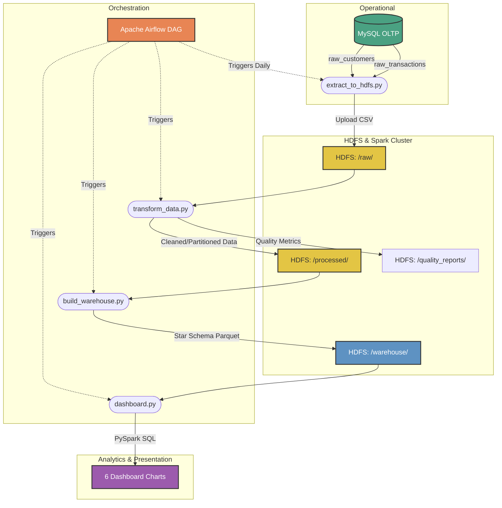

# 🏦 Banking CRM System — Data Engineering Capstone Project

A fully local, end-to-end data engineering pipeline for a Banking CRM system built on the **Hadoop ecosystem** and **Apache Spark**. This project demonstrates batch data processing from an OLTP database through a data lake, into a star schema data warehouse, with orchestration and visualization.

---


## 📐 Architecture Overview



---

## 🧱 Technology Stack

| Component | Technology | Container |
|-----------|-----------|-----------|
| OLTP Database | MySQL 8.0 | `crm_mysql` |
| Data Lake | HDFS (Hadoop 3.3.6) | `crm_namenode` + `crm_datanode` |
| Processing Engine | Apache Spark 3.5.1 | `crm_spark_master` + `crm_spark_worker` |
| Orchestration | Apache Airflow 2.8.1 | `crm_airflow` |
| Dashboard | matplotlib / PySpark | Runs inside Spark |

---

## 📋 Task Alignment

| Phase | Tasks Covered | Scripts |
|-------|--------------|---------|
| **Phase 1**: Environment & OLTP Setup | Task 1 (Linux), Task 6 (SQL), Task 8 (DB Concepts) | `docker-compose.yaml`, `setup_mysql.py` |
| **Phase 2**: Data Ingestion | Task 11 (Ingestion), Task 12 (Hadoop), Task 13 (HDFS) | `extract_to_hdfs.py` |
| **Phase 3**: Processing & Quality | Task 14 (Spark), Task 15 (DataFrames), Task 17 (PySpark), Task 29 (Quality) | `transform_data.py` |
| **Phase 4**: Data Warehousing | Task 9 (Warehousing), Task 16 (Spark SQL) | `build_warehouse.py` |
| **Phase 5**: Workflow Orchestration | Task 22 (Airflow Basics), Task 23 (Airflow Advanced) | `dags/banking_etl_dag.py` |
| **Phase 6**: Dashboarding | Task 30 (Final Project) | `dashboard.py` |

---

## 🚀 Setup & Running

### Prerequisites

- Docker & Docker Compose installed
- At least **8 GB RAM** allocated to Docker
- Ports available: 3306, 9870, 9000, 9864, 8080, 7077, 8081

### Step 1: Start All Services

```bash
docker-compose up -d
```

Wait ~60 seconds for all services to initialize. Verify:
- **HDFS NameNode UI**: http://localhost:9870
- **Spark Master UI**: http://localhost:8080
- **Airflow UI**: http://localhost:8081 (admin / mypass)

### Step 2: Populate MySQL (Phase 1)

```bash
docker exec -it crm_spark_master bash
pip install faker sqlalchemy pymysql
python /opt/spark/scripts/setup_mysql.py
```

### Step 3: Run the ETL Pipeline Manually

```bash
# Phase 2: Extract to HDFS
docker exec -it crm_spark_master bash
pip install pandas sqlalchemy pymysql
python /opt/spark/scripts/extract_to_hdfs.py

# Phase 3: Transform with Spark
docker exec -it crm_spark_master bash
/opt/spark/bin/spark-submit /opt/spark/scripts/transform_data.py

# Phase 4: Build Warehouse
docker exec -it crm_spark_master bash
/opt/spark/bin/spark-submit /opt/spark/scripts/build_warehouse.py

# Phase 6: Generate Dashboard
docker exec -it crm_spark_master bash
pip install matplotlib
/opt/spark/bin/spark-submit /opt/spark/scripts/dashboard.py
```

### Step 4: Run via Airflow (Phase 5)

1. Open http://localhost:8081
2. Login: `admin` / `mypass`
3. Enable the `banking_crm_etl_pipeline` DAG
4. Trigger a manual run

---

## 📁 Project Structure

```
banking-crm-system/
├── docker-compose.yaml          # All services: MySQL, HDFS, Spark, Airflow
├── hadoop.env                   # Hadoop configuration
├── README.md                    # This file
├── dags/
│   └── banking_etl_dag.py       # Airflow DAG (Phase 5)
├── data/                        # HDFS landing zone mount
└── scripts/
    ├── setup_mysql.py           # Phase 1: Create schema & populate data
    ├── extract_to_hdfs.py       # Phase 2: MySQL → HDFS ingestion
    ├── transform_data.py        # Phase 3: Spark ETL + data quality
    ├── build_warehouse.py       # Phase 4: Star schema builder
    ├── dashboard.py             # Phase 6: Visualization generator
    └── raw_transactions.csv     # Sample extracted data
```

---

## 📊 HDFS Directory Structure

```
/banking_crm/
├── raw/                         # Raw CSV extracts from MySQL
│   ├── raw_customers.csv
│   └── raw_transactions.csv
├── processed/                   # Cleaned Parquet (partitioned by transaction_type)
│   └── fact_transactions/
├── warehouse/                   # Star schema Parquet tables
│   ├── dim_customers/
│   ├── dim_date/
│   ├── dim_transaction_type/
│   ├── fact_transactions/       # Partitioned by year/month
│   └── analytics/               # Pre-computed query results
├── quality_reports/             # Data quality validation JSON
└── dashboard/                   # Generated chart PNGs
```

---

## 🌟 Star Schema Design

### Fact Table: `fact_transactions`
| Column | Type | Description |
|--------|------|-------------|
| transaction_id | STRING | Primary key |
| customer_id | INT | FK → dim_customers |
| date_key | INT | FK → dim_date (YYYYMMDD) |
| type_key | INT | FK → dim_transaction_type |
| amount | DOUBLE | Transaction value |
| status | STRING | Completed / Pending |
| is_anomaly | BOOLEAN | True if amount > $4,500 |

### Dimension: `dim_customers`
| Column | Type | Description |
|--------|------|-------------|
| customer_id | INT | Primary key |
| first_name, last_name | STRING | Customer name |
| email | STRING | Contact |
| account_type | STRING | Checking / Savings / Credit |
| join_date | DATE | Account creation |
| tenure_days | INT | Days since joining |

### Dimension: `dim_date`
| Column | Type | Description |
|--------|------|-------------|
| date_key | INT | YYYYMMDD format |
| full_date | DATE | Actual date |
| year, quarter, month, day | INT | Date parts |
| day_of_week | INT | 1=Sunday, 7=Saturday |
| is_weekend | BOOLEAN | Weekend flag |

### Dimension: `dim_transaction_type`
| Column | Type | Description |
|--------|------|-------------|
| type_key | INT | 1-4 |
| type_name | STRING | Deposit / Withdrawal / Transfer / Payment |
| type_description | STRING | Human-readable description |

---

## 📈 Dashboard Visualizations

| # | Chart | Description |
|---|-------|-------------|
| 1 | Monthly Revenue Trend | Dual-axis: transaction count (bars) + revenue (line) |
| 2 | Transaction Type Distribution | Pie charts: by count and by revenue |
| 3 | Top 10 Customers | Horizontal bar chart of highest spenders |
| 4 | Revenue by Account Type | Stacked bar chart by transaction type |
| 5 | Anomaly Rate Over Time | Bar + line: anomaly count and percentage |
| 6 | Transaction Heatmap | Day-of-week × hour grid visualization |

---

## 🔄 Airflow DAG

```
create_hdfs_dirs → extract_data → transform_data → build_warehouse → verify_outputs → generate_dashboard
```

- **Schedule**: Daily at 2:00 AM
- **Retries**: 2 attempts with 5-minute delay
- **Timeout**: 1 hour per task
- **Monitoring**: Airflow UI at http://localhost:8081

---

## 🛠️ Data Quality Checks

The pipeline validates data at Phase 3:

1. **Null Checks**: Critical columns (customer_id, amount, transaction_date) must not be null
2. **Amount Validation**: All amounts must be positive
3. **Duplicate Detection**: No duplicate transaction IDs allowed
4. **Type Validation**: Only valid transaction types (Deposit, Withdrawal, Transfer, Payment)
5. **Status Validation**: Only valid statuses (Completed, Pending, Failed)
6. **Summary Statistics**: Min, max, mean, stddev for transaction amounts

Quality reports are saved to HDFS at `/banking_crm/quality_reports/`.

---

## ⚠️ Troubleshooting

| Issue | Solution |
|-------|----------|
| HDFS connection refused | Wait 30-60 seconds after starting containers |
| Spark submit hangs | Check worker is registered at http://localhost:8080 |
| MySQL connection error | Verify `crm_mysql` container is healthy |
| Airflow DAG not showing | Check for Python syntax errors in DAG file |
| Out of memory | Increase Docker memory allocation to 8GB+ |
